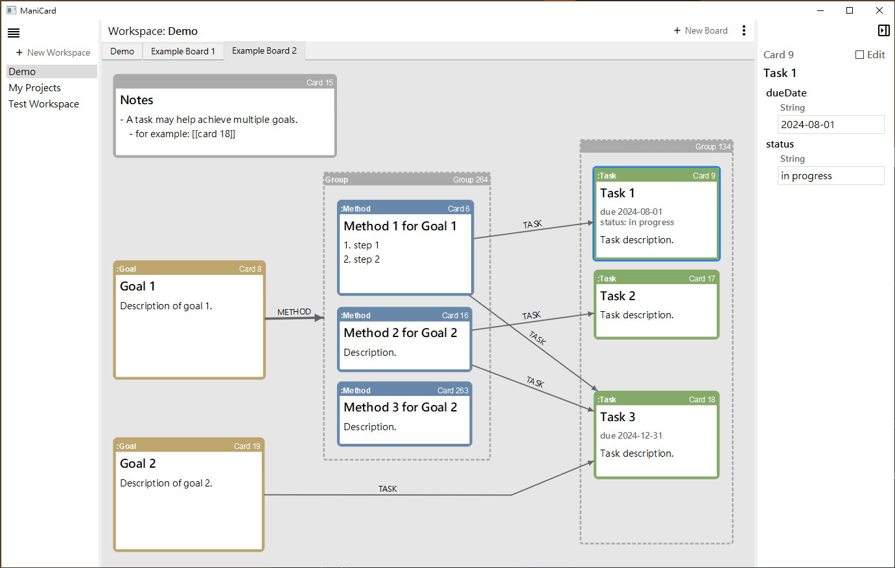
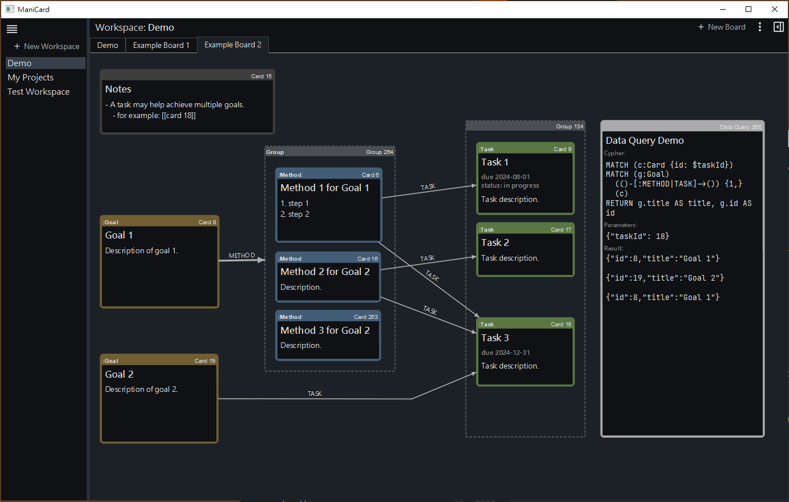

# ManiCard

A tool for viewing and editing textual contents and relationships of nodes stored in a Neo4j graph database.

It can be used to organize notes and visualize relations between them, similar to Obsidian's 
Canvas view but backed with a graph database.

Note that this project is still in very early phase of development.

## Screenshots





## Features

Card, Board & Workspace

+ A card is a node in the DB with label `Card` and properties `id`, `title`, and `text` (together with other custom labels and properties).
+ A card can be opened in multiple boards.
+ On a board, all relationships between opened cards are shown.
+ The arrow representing a relationship can be adjusted manually by adding/dragging joints on it.
+ Related boards can be contained in a workspace.
+ Associate colors to labels of cards.
    + Different label-color mappings can be set on different workspaces.

Groups

+ Cards can be grouped together so that
    + they move together
    + if a card ouside the group has relationships of the same type to every of the cards in the group, the relationships are displayed as a bundled arrow to the group's box (this is to reduce visual clutter).
+ Groups (and cards) can also be grouped together.

Card Properties

+ View, add, and edit properties of the selected card in right sidebar.
+ Set which properties are shown directly in the cards' display boxes, for cards with specific label.

Query

+ Run (read-only) Cypher query and view the result as JSON objects or markdown table.
+ Save the result of Cypher query to a JSON file.

View

+ Light & dark theme.
+ Basic markdown preview.
+ High-DPI scaling on Windows.

## Build & Run the App

Qt 5 and Qt Creator are needed to build the app.

To run the app, you need to

+ install a self-managed Neo4j DB (Neo4j Aura is not supported)
+ setup the DB:
    + Create constraints requiring unique value of `id` property for nodes with label `Card`, `CustomDataQuery`, `GroupBox`, `Board`,  and `Workspace`.
    ```cypher
    CREATE CONSTRAINT unique_card_id
    FOR (c:Card) REQUIRE c.id IS UNIQUE;
    ```
    ```cypher
    CREATE CONSTRAINT unique_custom_data_query_id
    FOR (q:CustomDataQuery) REQUIRE q.id IS UNIQUE;
    ```
    ```cypher
    CREATE CONSTRAINT unique_group_box_id
    FOR (q:GroupBox) REQUIRE q.id IS UNIQUE;
    ```
    ```cypher
    CREATE CONSTRAINT unique_board_id
    FOR (b:Board) REQUIRE b.id IS UNIQUE;
    ```
    ```cypher
    CREATE CONSTRAINT unique_workspace_id
    FOR (w:Workspace) REQUIRE w.id IS UNIQUE;
    ```
    + Create nodes for last-used IDs for cards and boards.
        ```cypher
        MERGE (n:LastUsedId {itemType: 'Card'})
        ON CREATE SET n.value = 0
        RETURN n;
        ```   
        ```cypher
        MERGE (n:LastUsedId {itemType: 'Board'})
        ON CREATE SET n.value = 0
        RETURN n;
        ```
+ create a `config.json` file under the same directory as the executable (see `src/config.example.json` 
  for an example)

It is recommended that you choose a dedicated DB for this app and backup the DB from time to time.

### Current Limitations

+ Only supports self-managed Neo4j DB (as opposed to Neo4j Aura).
+ Only supports single-instance Neo4j DB (as opposed to a cluster).
+ No automatic sync between multiple instances of the app (running on difference devices) that connect to the 
  same Neo4j DB instance. It is recommended to run the app on single device at a time.
+ Updates that cannot be saved to DB because of connection issues are recorded in a text file, but they are not 
  retried. After resolving DB connection issues, you need to re-open the app, and apply the unsaved 
  updates manually. It is recommended to install the Neo4j DB locally (i.e., on the device where the app is running) to avoid this problem.
